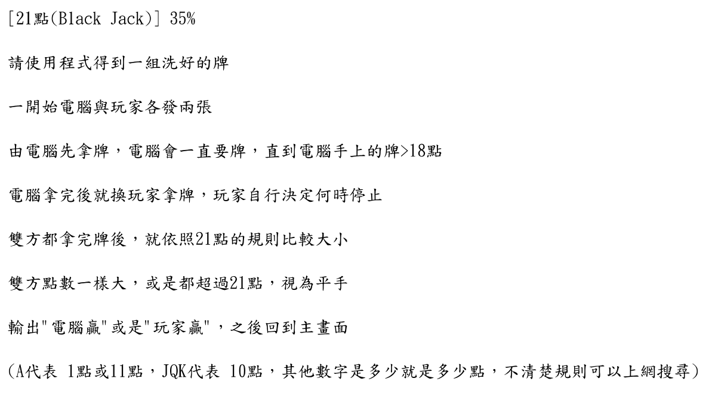
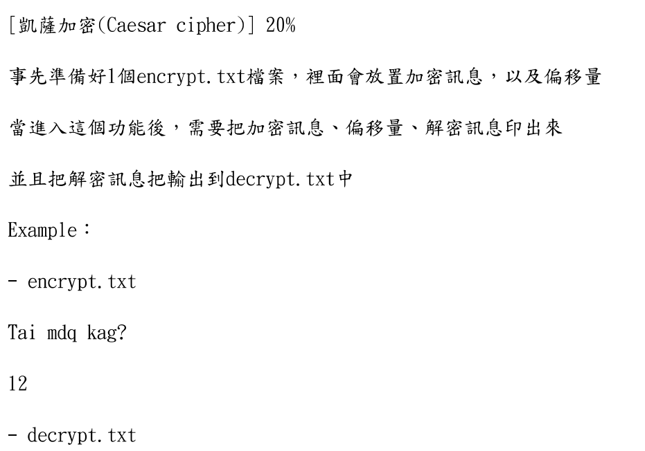

# Final Programming project

## Feature

1. black jack game

2. cows and bulls

3. caesar cipher

4. Computer played caws and bulls

## Speciality

### Full colored

### Nothing else

## Dependencies

All wrote by myself

<!--
1. [color-console](https://github.com/aafulei/color-console)
-->

### Appendix

#### Color and number in windows

|Number|Color|
|---|---|
|0|Black|
|1|Blue|
|2|Green|
|3|Aqua|
|4|Red|
|5|Purple|
|6|Yellow|
|7|White|
|8|Grey|
|9|Light Blue|
|10|Light Green|
|11|Light Aqua|
|12|Light Red|
|13|Light Purple|
|14|Light Yellow|
|15|Bright White|
